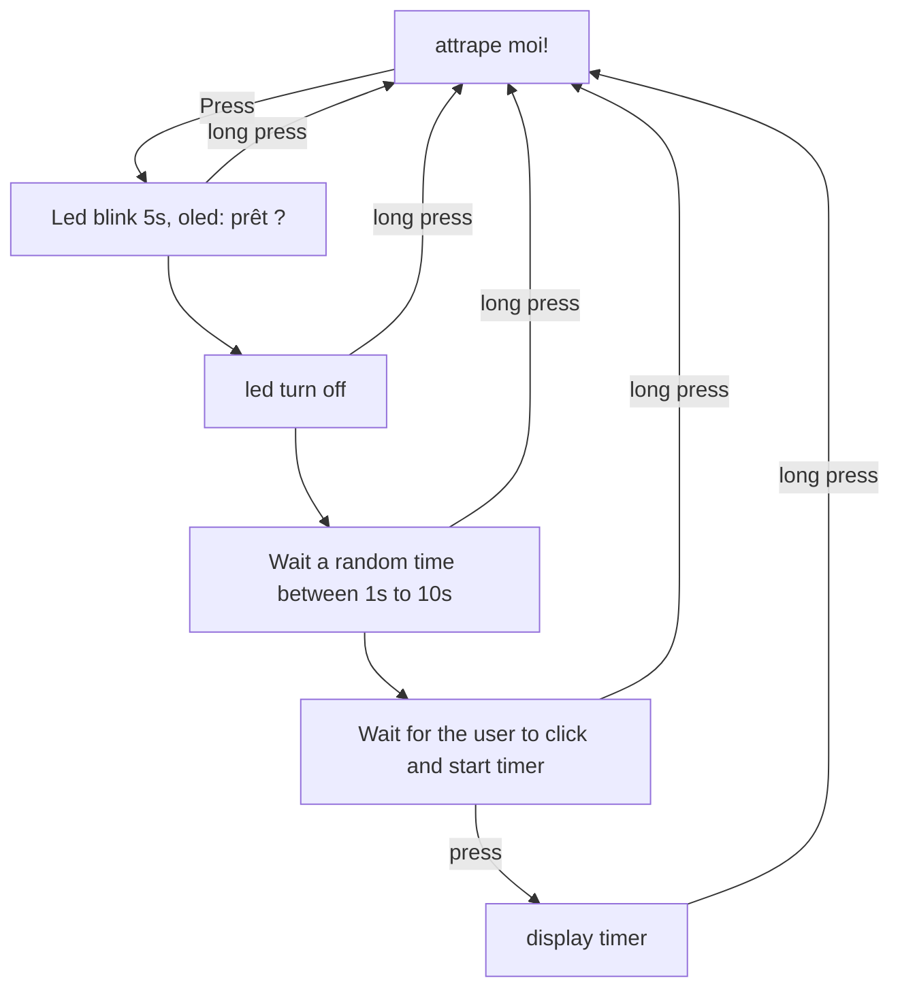

```mermaid
graph TD
    A[attrape moi!] --> |Press| B[Led blink 5s, oled: prêt ?]
    B --> C[led turn off]
    C --> D[Wait a random time between 1s to 10s]
    D --> E[Wait for the user to click and start timer]
    E --> |press| F[display timer]
    B --> |long press| A
    C --> |long press| A
    D --> |long press| A
    E --> |long press| A
    F --> |long press| A
```